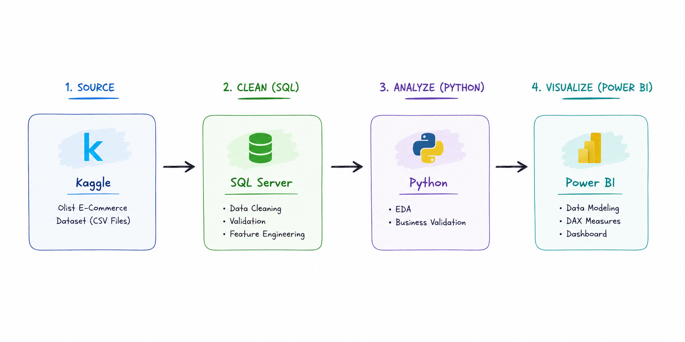

# 🔍 Olist Customer Dissatisfaction Analysis

An end-to-end analytics project that combines SQL, Python, and Power BI to analyze customer dissatisfaction on the Olist platform.

The project identifies the operational drivers of negative customer experiences, validates analytical assumptions through exploratory analysis, and translates the findings into an interactive business dashboard with actionable recommendations.

<p align="center">
  
</p>

---

## 📊 Project Snapshot

|                     |                                                       |
| ------------------- | ----------------------------------------------------- |
| **Domain**          | E-commerce                                            |
| **Dataset**         | Brazilian E-Commerce Public Dataset by Olist          |
| **Scale**           | 99K+ Orders · 96K+ Customers                          |
| **Analysis Period** | Sep 2016 – Aug 2018                                   |
| **Tools**           | SQL Server · Python · Power BI                        |
| **Focus**           | Customer Experience Analytics · Operational Analytics |

---

## 📈 Dashboard Preview

🔗 [View the live dashboard](https://lnkd.in/gea766am)


---

## 🎯 Business Context

Although **14.7% of Olist orders receive negative reviews (1–2★)**, the underlying drivers of customer dissatisfaction remain unclear. Moreover, not all dissatisfied customers contribute equally to business value.

This project aims to answer:

* Which customer segments should Olist prioritize?
* What operational factors drive customer dissatisfaction?
* How do delivery performance, seller quality, and product quality affect customer experience?
* Which business initiatives should be prioritized to maximize customer satisfaction?

---

## 💡 Key Insights

### 🚚 Delivery Performance
Delivery delay is the strongest driver of customer dissatisfaction.
* Orders delivered after **35+ days** receive **9.5×** more negative reviews than orders delivered within 7 days.
* More than **11,600 orders** exceeded the 21-day delivery risk threshold.

### 👥 Customer Value Segmentation
Customer dissatisfaction does not affect all customers equally.
* Only **21% of customers generate 48.2% of total revenue**.
* High-value customer segments exhibit distinct dissatisfaction patterns, requiring differentiated improvement strategies.

### 🛍 Seller & Product Quality
Customer dissatisfaction is concentrated among a relatively small group of sellers and product categories, enabling targeted quality improvement instead of platform-wide interventions.

### 🌎 Regional Performance
North and Northeast Brazil consistently underperform São Paulo in both delivery reliability and customer satisfaction, indicating structural logistics gaps.

---

## 🚀 Business Recommendations

1. **Strengthen delivery reliability** through proactive SLA monitoring, early-warning mechanisms, and carrier capacity planning during peak periods.

2. **Improve seller and product quality management** through performance monitoring while tailoring remediation strategies for high-priority customer segments.

3. **Invest in logistics capabilities across the North and Northeast regions** through expanded carrier partnerships and enhanced fulfillment capacity.

---

## 🛠 Technical Highlights

- **Built an end-to-end analytics workflow** using SQL Server, Python, and Power BI.

- **Designed a SQL data-cleaning pipeline** to standardize raw Olist tables, remove duplicate reviews, engineer analytical features, and generate reusable analytical tables.

- **Conducted exploratory data analysis (EDA) in Python** to validate business assumptions, identify delivery-risk thresholds, and investigate operational drivers of customer dissatisfaction.

- **Diagnosed the limitations of classical RFM segmentation** and validated a rule-based customer segmentation approach using **K-Means clustering**.

- **Built a multi-fact dimensional data analytical model** to support cross-functional analysis across orders, reviews, sellers, products, payments, and logistics data.

- **Developed custom DAX measures** to support customer satisfaction analysis, customer value segmentation, delivery performance monitoring, and seller/category risk identification.

- **Applied benchmark-based regional analysis and an Impact-vs-Effort prioritization framework** to translate analytical findings into actionable business recommendations.

---

## 📂 Project Structure

```text
project/
│
├── sql/
│   └── 01_clean_data.sql
│
├── python/
│   ├── 01_data_cleaning_validation.ipynb
│   ├── 02_eda_dissatisfaction_drivers.ipynb
│   └── 03_customer_segmentation_validation.ipynb
│
├── powerbi/
│   └── PBIX available upon request
│
├── report/
│   └── Olist_Report.pdf
│
└── README.md
```
*Power BI (.pbix) file is available upon request due to GitHub file size limitations.*
